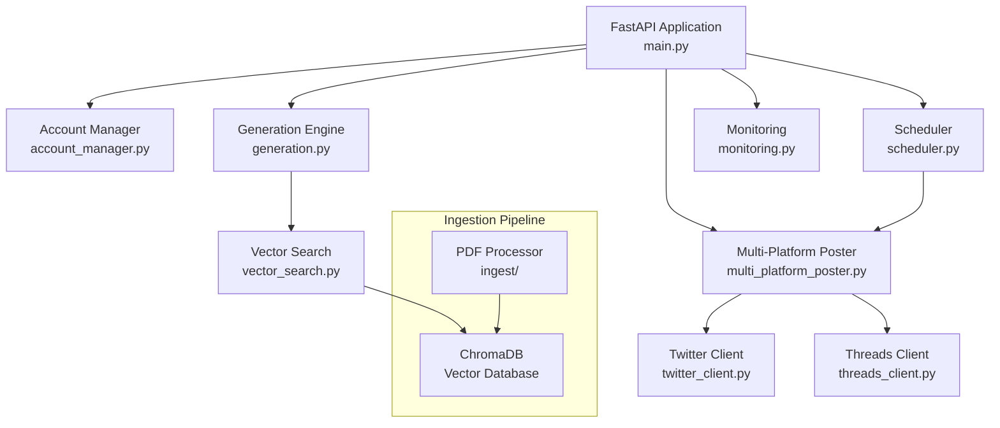

# Multi-Platform Social Media Persona Agents

This document outlines the engineering approach for building an autonomous multi-account social media system. The system generates and posts philosophical content across Twitter and Meta Threads by synthesizing teachings from sources like Eckhart Tolle and Carolyn Elliott through AI-powered personas.

The system consists of three main components:
- **Frontend**: React-based control panel for account management and monitoring
- **Backend**: FastAPI server with multi-platform posting and content generation
- **Ingestion**: Knowledge base builder from PDF philosophical texts

Key Features:
- Multi-account support with unique personas per account
- Simultaneous posting to Twitter and Threads
- RAG-based content generation from philosophical texts
- Automated scheduling with catch-up mechanisms

---

## Structure
- `/app` - Backend application services
- `/accounts` - Account configuration files
- `/ingest` - Knowledge base ingestion pipeline
- `/data` - Vector database and activity logs
- `/config` - System configuration
- `/scripts` - Utility and migration scripts
- `/docker` - Container deployment files

### **0. Quick Start**

To start all services:
```bash
source venv/bin/activate  # Activate virtual environment
./start_local.sh         # Start locally
# OR
./deploy-24-7.sh        # Deploy with Docker for 24/7 operation
```

This will start:
- ChromaDB vector database
- FastAPI backend on port 8582
- Web control panel at http://localhost:8582
- APScheduler for automated posting

### **1. Frontend - Web Control Panel**

#### 1.1 **Overview**
The frontend is a single-page web application providing real-time monitoring and control over all social media accounts. It features account management, content generation testing, and system health monitoring.

#### 1.2 **Technology Stack**
- **HTML/CSS/JavaScript**: Vanilla implementation for simplicity
- **WebSockets**: Real-time status updates
- **Fetch API**: REST communication with backend

#### 1.3 **Key Features**

##### Account Management
- View all configured accounts with platform status
- Test content generation per account
- Force immediate posts to specific platforms
- Monitor account-specific activity

##### System Monitoring
- Real-time cost tracking against daily limits
- Platform API health checks
- Activity history and error logs
- Emergency stop controls

##### Knowledge Base Explorer
- Search philosophical content chunks
- View vector similarity results
- Test retrieval quality

---

### **2. Backend - FastAPI Server**

## Architecture Overview



## Component Walkthrough

### 1. Main Application (`app/main.py`)

The central FastAPI application managing all API endpoints and web UI. Key endpoints include:

- `/api/accounts`: List all configured social media accounts
- `/api/force-post/{account_id}`: Trigger immediate post for account
- `/api/test-generation/{account_id}`: Generate test content without posting
- `/api/status/{account_id}`: Get account-specific health and metrics

### 2. Account Management (`app/account_manager.py`)

Manages multiple social media accounts with:
- Dynamic account discovery from JSON files
- Platform credential management
- Per-account persona and knowledge base configuration

### 3. Content Generation (`app/generation.py`)

Core content generation engine implementing:
- Random seed selection from knowledge base
- Context retrieval using k-NN similarity search
- Dynamic prompt construction with persona and exemplars
- Platform-specific content adaptation (Twitter 280, Threads 500 chars)

### 4. Multi-Platform Integration

- **twitter_client.py**: Twitter API v2 integration with OAuth 1.0a
- **threads_client.py**: Meta Threads Graph API integration
- **multi_platform_poster.py**: Unified posting coordinator

### 5. Scheduling System (`app/scheduler.py`)

APScheduler-based automation with:
- Configurable posting intervals (default 12 hours)
- Catch-up mechanism for missed posts
- Parallel posting to all platforms
- Account-specific scheduling

### 6. Knowledge Base (`ingest/`)

Document processing pipeline:
- **split_embed.py**: Main ingestion script
- **pdf_processor.py**: PDF text extraction and cleaning
- **chunk_creator.py**: Large-chunk strategy (~1500 words)
- **embedder.py**: OpenAI embeddings generation

### 7. Monitoring (`app/monitoring.py`)

System observability features:
- Real-time cost tracking with daily limits
- Activity logging to SQLite database
- Performance metrics and error tracking
- Emergency stop capabilities

## Data Flow

1. **Ingestion Phase**:
   - PDFs processed into clean text chunks
   - Chunks embedded using OpenAI text-embedding-3-small
   - Embeddings stored in ChromaDB with metadata

2. **Generation Phase**:
   - Random chunk selected as seed
   - Similar chunks retrieved for context
   - Prompt constructed with persona + context + exemplars
   - Content generated via OpenAI API

3. **Posting Phase**:
   - Content adapted for platform limits
   - Posted simultaneously to all enabled platforms
   - Activity logged with cost tracking
   - Errors handled with exponential backoff

## Multi-Account Configuration

Each account is defined in `accounts/{account_id}.json`:

```json
{
  "account_id": "unique_identifier",
  "display_name": "Account Display Name",
  "persona": "Personality description...",
  "exemplars": ["Example post 1", "Example post 2"],
  "vector_collection": "knowledge_base_name",
  "posting_platforms": ["twitter", "threads"],
  "twitter_credentials": {
    "bearer_token": "env:TWITTER_BEARER_TOKEN",
    "api_key": "env:TWITTER_API_KEY",
    "api_secret": "env:TWITTER_API_SECRET",
    "access_token": "env:TWITTER_ACCESS_TOKEN",
    "access_token_secret": "env:TWITTER_ACCESS_TOKEN_SECRET"
  },
  "threads_credentials": {
    "access_token": "env:THREADS_ACCESS_TOKEN",
    "user_id": "env:THREADS_USER_ID"
  }
}
```

## Development Setup

The system uses a Python virtual environment with all dependencies managed through pip:

```bash
# Environment already exists - just activate
source venv/bin/activate

# Install/update dependencies if needed
pip install -r requirements.txt
pip install -r requirements-dev.txt
```

### Running Locally

1. **Configure API Keys**:
   ```bash
   cp config/secrets.env.example config/.env
   # Edit .env with your API credentials
   ```

2. **Add Source Material**:
   ```bash
   # Place PDF books in data directory
   mkdir -p data/source_material
   # Copy philosophical PDFs here
   ```

3. **Build Knowledge Base**:
   ```bash
   python -m ingest.split_embed
   ```

4. **Start Application**:
   ```bash
   uvicorn app.main:app --host 0.0.0.0 --port 8582 --reload
   ```

### API Documentation
FastAPI automatically generates interactive API documentation:
- Swagger UI: `http://localhost:8582/docs`
- ReDoc: `http://localhost:8582/redoc`

## API Reference

### Public Endpoints

| Method | Endpoint | Purpose |
|--------|----------|---------|  
| GET | / | Web dashboard with account management UI |
| GET | /health | Basic health check |
| GET | /health/deep | Comprehensive health check with dependency validation |

### System Control Endpoints

| Method | Endpoint | Purpose |
|--------|----------|---------|  
| POST | /emergency-stop | Toggle emergency stop for all posting |
| GET | /api/status | Overall system status with costs and health |
| POST | /api/resume-scheduler | Resume paused scheduler |
| POST | /api/pause-scheduler | Pause running scheduler |
| POST | /api/restart-scheduler | Stop and restart scheduler |

### Account Management Endpoints

| Method | Endpoint | Handler | Notes |
|--------|----------|---------|-------|
| GET | /api/accounts | account_manager | List all configured accounts |
| GET | /api/status/{account_id} | monitoring | Account-specific status and metrics |
| GET | /api/platform-info/{account_id} | multi_platform_poster | Platform details for account |
| POST | /api/test-connections/{account_id} | multi_platform_poster | Test all platform connections |

### Content Generation Endpoints

| Method | Endpoint | Handler | Notes |
|--------|----------|---------|-------|
| POST | /api/test-generation/{account_id} | generation | Generate test content without posting |
| POST | /api/force-post/{account_id} | multi_platform_poster | Force post to all enabled platforms |
| POST | /api/force-post-platform/{account_id}/{platform} | multi_platform_poster | Force post to specific platform (twitter/threads) |

### Persona & Exemplar Management

| Method | Endpoint | Handler | Notes |
|--------|----------|---------|-------|
| POST | /api/persona/{account_id} | account_manager | Update account persona |
| POST | /api/exemplars/{account_id} | account_manager | Add new exemplar tweet |
| DELETE | /api/exemplars/{account_id}/{exemplar_id} | account_manager | Delete exemplar tweet |

### Knowledge Base Endpoints

| Method | Endpoint | Handler | Notes |
|--------|----------|---------|-------|
| GET | /api/search-chunks/{account_id} | vector_search | Search account's knowledge base (query, limit params) |

### Monitoring & Analytics

| Method | Endpoint | Handler | Notes |
|--------|----------|---------|-------|
| GET | /api/logs | monitoring | Get activity logs (limit param) |
| GET | /api/costs | monitoring | API cost breakdown and 7-day history |
| GET | /api/cost-summary | monitoring | Detailed cost summary |

### Legacy Single-Account Endpoints (Backward Compatibility)

| Method | Endpoint | Purpose |
|--------|----------|---------|  
| POST | /api/force-post | Force post for default account |
| POST | /api/test-generation | Test generation for default account |
| POST | /api/persona | Update default persona |
| POST | /api/exemplars | Add exemplar to default account |
| DELETE | /api/exemplars/{exemplar_id} | Delete exemplar from default account |
| GET | /api/search-chunks | Search default knowledge base |